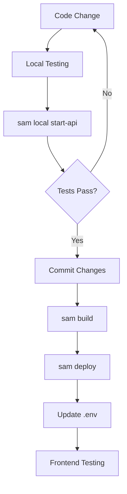
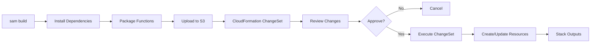

# SAM Deployment Architecture - Technical Reference

This document provides detailed technical documentation for the AWS SAM (Serverless Application Model) infrastructure that manages Lambda functions and API Gateway for the Writers Almanac application.

## Table of Contents

- [Overview](#overview)
- [Architecture Decisions](#architecture-decisions)
- [SAM Template Structure](#sam-template-structure)
- [Parameters](#parameters)
- [Global Configuration](#global-configuration)
- [Resources](#resources)
- [Outputs](#outputs)
- [IAM Permissions and Security](#iam-permissions-and-security)
- [Multi-Environment Strategy](#multi-environment-strategy)
- [Performance Optimization](#performance-optimization)
- [Cost Analysis](#cost-analysis)
- [Deployment Workflow](#deployment-workflow)

---

## Overview

The Writers Almanac Lambda deployment uses AWS SAM to manage infrastructure as code. SAM provides:

- **Single-command deployment**: `sam deploy` replaces manual ZIP uploads
- **CloudFormation integration**: Infrastructure changes tracked in version control
- **Local testing**: Test Lambda functions locally before deployment
- **Automatic IAM roles**: SAM creates least-privilege execution roles
- **API Gateway automation**: CORS, stages, and routes configured declaratively

### What SAM Manages

✅ **Managed by SAM**:
- 3 Lambda functions (get-author, get-authors-by-letter, search-autocomplete)
- API Gateway REST API with routes
- Lambda execution IAM roles
- CloudWatch Log groups
- API Gateway stage (Prod)

❌ **NOT managed by SAM** (Brownfield integration):
- S3 bucket (existing, contains live data)
- CloudFront distribution (existing, serves production traffic)
- Domain names / Route53 records
- Monitoring alarms (future enhancement)

---

## Architecture Decisions

### ADR-001: Brownfield SAM Integration

**Decision**: SAM template references existing S3 bucket rather than creating new infrastructure.

**Rationale**:
- S3 bucket contains production data (poems, authors, audio files)
- CloudFront distribution already serves traffic
- Migrating data is risky and unnecessary
- SAM manages stateless compute layer only

**Implementation**:
```yaml
Parameters:
  S3BucketName:
    Type: String
    Description: Existing S3 bucket (not created by this template)
```

Lambda functions receive bucket name as environment variable, not as managed resource.

### ADR-002: Single REST API Resource

**Decision**: Use single API Gateway REST API resource for all endpoints.

**Rationale**:
- Simpler configuration than separate APIs
- All endpoints share CORS settings
- Single API URL for frontend
- Easier to manage API Gateway limits

**Alternative Considered**: HTTP API (cheaper, faster) - not chosen because REST API provides better integration with SAM and existing infrastructure.

### ADR-003: Environment-Aware Resource Naming

**Decision**: Resource names include environment suffix (e.g., `-prod`, `-staging`).

**Rationale**:
- Prevents name collisions across environments
- Enables multi-environment deployment with same template
- CloudFormation stack outputs clearly identify environment
- Lambda function names match environment in CloudWatch Logs

**Implementation**:
```yaml
FunctionName: !Sub 'writers-almanac-get-author-${Environment}'
```

### ADR-004: Global Configuration with DRY Principles

**Decision**: Use SAM `Globals` section for shared Lambda configuration.

**Rationale**:
- All functions use same runtime (Node.js 18.x)
- All functions need same environment variables (S3_BUCKET, AWS_REGION)
- Reduces duplication in template
- Easy to update shared settings in one place

---

## SAM Template Structure

The template (`lambda/template.yaml`) follows this structure:

```yaml
AWSTemplateFormatVersion: '2010-09-09'
Transform: AWS::Serverless-2016-10-31  # SAM Transform

Parameters:        # Environment-specific values
  - Environment
  - S3BucketName
  - AWSRegion

Globals:           # Shared configuration (DRY)
  Function:        # Applied to all Lambda functions
    - Runtime, Timeout, MemorySize
    - Environment variables
    - Tags
  Api:             # Applied to API Gateway
    - CORS settings
    - Tracing

Resources:         # Infrastructure components
  - WritersAlmanacApi (API Gateway)
  - GetAuthorFunction (Lambda)
  - GetAuthorsByLetterFunction (Lambda)
  - SearchAutocompleteFunction (Lambda)

Outputs:           # Deployment information
  - API Gateway URL
  - Lambda ARNs
  - Stack name
```

---

## Parameters

### Environment

```yaml
Environment:
  Type: String
  Default: prod
  AllowedValues: [dev, staging, prod]
```

**Purpose**: Identifies deployment environment for resource naming and tagging.

**Usage**: Appended to resource names via `!Sub` function:
```yaml
FunctionName: !Sub 'writers-almanac-get-author-${Environment}'
```

**Override**: Set in `samconfig.toml` or via CLI:
```bash
sam deploy --parameter-overrides "Environment=staging"
```

### S3BucketName

```yaml
S3BucketName:
  Type: String
  Description: Existing S3 bucket containing author and poem data
```

**Purpose**: References existing S3 bucket (not created by template).

**Usage**: Passed to Lambda functions as environment variable and in IAM policies:
```yaml
Environment:
  Variables:
    S3_BUCKET: !Ref S3BucketName
Policies:
  - S3ReadPolicy:
      BucketName: !Ref S3BucketName
```

**Override**: Set in `samconfig.toml`:
```toml
parameter_overrides = [
    "S3BucketName=writers-almanac-data-prod"
]
```

### AWSRegion

```yaml
AWSRegion:
  Type: String
  Default: us-east-1
```

**Purpose**: AWS region for deployment and S3 access.

**Usage**: Passed to Lambda functions as environment variable:
```yaml
Environment:
  Variables:
    AWS_REGION: !Ref AWSRegion
```

**Note**: Also available via intrinsic `AWS::Region` pseudo-parameter.

---

## Global Configuration

### Function Globals

```yaml
Globals:
  Function:
    Runtime: nodejs18.x
    Timeout: 30
    MemorySize: 256
```

Applied to all Lambda functions unless overridden in individual function definition.

**Runtime**: Node.js 18.x
- Matches existing Lambda function code
- Long-term support (LTS) release
- Modern JavaScript features (ES2022)

**Timeout**: 30 seconds
- Sufficient for S3 GetObject operations
- Prevents runaway executions
- API Gateway has 29-second timeout (Lambda must be lower)

**MemorySize**: 256 MB (default)
- Adequate for most operations
- `SearchAutocompleteFunction` overrides to 512 MB for caching

**Environment Variables**:
```yaml
Environment:
  Variables:
    NODE_ENV: production
    AWS_REGION: !Ref AWSRegion
    S3_BUCKET: !Ref S3BucketName
```

**Tags**:
```yaml
Tags:
  Application: WritersAlmanac
  Environment: !Ref Environment
  ManagedBy: SAM
```

Tags enable cost tracking and resource management.

### API Globals

```yaml
Globals:
  Api:
    Cors:
      AllowOrigin: "'*'"
      AllowMethods: "'GET,OPTIONS'"
      AllowHeaders: "'Content-Type,Authorization'"
    TracingEnabled: true
```

**CORS**: Enabled for all API Gateway routes
- Allows requests from any origin (frontend)
- Supports GET and OPTIONS (preflight)
- Lambda functions also return CORS headers

**Tracing**: AWS X-Ray tracing enabled
- Visualize request flow through API Gateway and Lambda
- Debug performance issues
- Analyze cold starts

---

## Resources

### WritersAlmanacApi (API Gateway REST API)

```yaml
WritersAlmanacApi:
  Type: AWS::Serverless::Api
  Properties:
    Name: !Sub 'writers-almanac-api-${Environment}'
    StageName: Prod
    Description: REST API for Writers Almanac application
    EndpointConfiguration:
      Type: REGIONAL
```

**StageName**: `Prod` (default SAM stage)
- URL pattern: `https://{api-id}.execute-api.{region}.amazonaws.com/Prod`
- Single stage for simplicity
- Future enhancement: Add dev/staging stages

**EndpointConfiguration**: `REGIONAL`
- Lower latency for single-region deployment
- Alternative: `EDGE` (CloudFront-backed, global)

### Lambda Functions

All three Lambda functions follow this pattern:

```yaml
GetAuthorFunction:
  Type: AWS::Serverless::Function
  Properties:
    FunctionName: !Sub 'writers-almanac-get-author-${Environment}'
    Description: Fetch author data from S3 by author name/slug
    CodeUri: get-author/
    Handler: index.handler
    Policies:
      - S3ReadPolicy:
          BucketName: !Ref S3BucketName
      - CloudWatchLogsFullAccess
    Events:
      GetAuthorApi:
        Type: Api
        Properties:
          RestApiId: !Ref WritersAlmanacApi
          Path: /api/author/{name}
          Method: get
```

**CodeUri**: Path to function directory
- SAM builds from this directory
- Must contain `index.js` and `package.json`
- Dependencies installed during `sam build`

**Handler**: `index.handler`
- Exports from `index.js`: `exports.handler`

**Policies**: Managed policies via SAM templates
- `S3ReadPolicy`: Grants `s3:GetObject` on specified bucket
- `CloudWatchLogsFullAccess`: Enables logging (auto-created by SAM)

**Events**: API Gateway integration
- Automatically creates API Gateway route
- Path parameters (e.g., `{name}`) passed to Lambda event
- CORS enabled via Globals

### SearchAutocompleteFunction Overrides

```yaml
SearchAutocompleteFunction:
  Properties:
    MemorySize: 512  # Override global 256 MB
    Timeout: 30      # Same as global (explicit)
```

**Rationale**: Search function caches author slugs in memory, requiring more RAM.

---

## Outputs

```yaml
Outputs:
  ApiUrl:
    Description: API Gateway endpoint URL for production stage
    Value: !Sub 'https://${WritersAlmanacApi}.execute-api.${AWS::Region}.amazonaws.com/Prod'
    Export:
      Name: !Sub 'WritersAlmanacApiUrl-${Environment}'
```

**Purpose**: Display deployed API URL after `sam deploy`

**Export**: Enables cross-stack references (future enhancement for frontend stack)

**Usage**: Copy `ApiUrl` to `.env` file:
```bash
VITE_API_BASE_URL=https://abc123xyz.execute-api.us-east-1.amazonaws.com/Prod
```

---

## IAM Permissions and Security

### Lambda Execution Role

SAM automatically creates an execution role for each Lambda function with:

1. **AWSLambdaBasicExecutionRole** (managed policy)
   - `logs:CreateLogGroup`
   - `logs:CreateLogStream`
   - `logs:PutLogEvents`

2. **S3ReadPolicy** (SAM policy template)
   ```json
   {
     "Effect": "Allow",
     "Action": ["s3:GetObject"],
     "Resource": "arn:aws:s3:::your-bucket-name/*"
   }
   ```

3. **S3 ListBucket** (for search-autocomplete)
   ```json
   {
     "Effect": "Allow",
     "Action": ["s3:ListBucket"],
     "Resource": "arn:aws:s3:::your-bucket-name"
   }
   ```

### Deployment Permissions

To deploy SAM template, your AWS user/role needs:

```json
{
  "Version": "2012-10-17",
  "Statement": [
    {
      "Effect": "Allow",
      "Action": [
        "cloudformation:*",
        "lambda:*",
        "apigateway:*",
        "iam:CreateRole",
        "iam:PutRolePolicy",
        "iam:AttachRolePolicy",
        "iam:GetRole",
        "iam:PassRole",
        "s3:CreateBucket",
        "s3:PutObject",
        "s3:GetObject",
        "logs:*"
      ],
      "Resource": "*"
    }
  ]
}
```

**Note**: This is broad. Restrict in production with resource-level permissions.

### Security Best Practices

1. **Least Privilege**: Lambda functions can only read from S3, not write
2. **No Hardcoded Secrets**: All config via parameters/environment variables
3. **CORS Restrictions**: Consider restricting `AllowOrigin` in production:
   ```yaml
   AllowOrigin: "'https://yourdomain.com'"
   ```
4. **API Gateway Rate Limiting**: Default 10,000 req/sec per API (AWS limit)
5. **X-Ray Tracing**: Enabled for security auditing and debugging

---

## Multi-Environment Strategy

The template is designed for multi-environment deployment:

### samconfig.toml Configuration

```toml
[default]
[default.deploy.parameters]
stack_name = "writers-almanac-backend-prod"
parameter_overrides = [
    "Environment=prod",
    "S3BucketName=writers-almanac-data-prod",
    "AWSRegion=us-east-1"
]

[staging]
[staging.deploy.parameters]
stack_name = "writers-almanac-backend-staging"
parameter_overrides = [
    "Environment=staging",
    "S3BucketName=writers-almanac-data-staging",
    "AWSRegion=us-east-1"
]

[dev]
[dev.deploy.parameters]
stack_name = "writers-almanac-backend-dev"
parameter_overrides = [
    "Environment=dev",
    "S3BucketName=writers-almanac-data-dev",
    "AWSRegion=us-east-1"
]
```

### Deploy to Different Environments

```bash
# Deploy to production (default)
sam deploy

# Deploy to staging
sam deploy --config-env staging

# Deploy to dev
sam deploy --config-env dev
```

### Resource Isolation

Each environment creates separate:
- CloudFormation stack
- Lambda functions (name includes environment)
- API Gateway API
- IAM roles

S3 buckets are environment-specific but NOT created by template (brownfield).

---

## Performance Optimization

### Cold Start Optimization

**Current**:
- Minimal dependencies (@aws-sdk/client-s3 only)
- S3 client initialized outside handler (reused across invocations)
- Lightweight code (~10KB per function)

**Result**: Cold start ~2-3 seconds, warm invocation ~100-500ms

**Future Enhancements**:
- Provisioned Concurrency (costs ~$35/month per function)
- Lambda SnapStart (not supported for Node.js yet)

### Memory vs. Cost Trade-off

| Function | Memory | CPU | Cost (1M req) | Rationale |
|----------|--------|-----|---------------|-----------|
| get-author | 256 MB | Low | $0.42 | Simple S3 GetObject |
| get-authors-by-letter | 256 MB | Low | $0.42 | Single S3 GetObject |
| search-autocomplete | 512 MB | Medium | $0.83 | In-memory caching, ListBucket |

**Total cost**: ~$1.67 per million requests (within free tier for most apps)

### Caching Strategy

**search-autocomplete**:
- In-memory cache of author slugs (TTL: 1 hour)
- Reduces S3 ListBucket calls from N to 1 per hour
- Saves ~$0.005 per 1,000 requests

**Future**: Consider API Gateway caching ($0.02/hour + $0.09/GB)

---

## Cost Analysis

### Lambda Costs

**Free Tier** (first 12 months):
- 1 million requests/month free
- 400,000 GB-seconds compute free

**Beyond Free Tier**:
- Requests: $0.20 per 1M requests
- Compute: $0.0000166667 per GB-second

**Estimated Monthly Cost** (100K requests/month):
- Requests: $0.02
- Compute (256 MB, 500ms avg): $0.21
- **Total**: ~$0.25/month

### API Gateway Costs

**Free Tier** (first 12 months):
- 1 million API calls/month free

**Beyond Free Tier**:
- $3.50 per million API calls

**Estimated Monthly Cost** (100K requests/month):
- $0.35/month

### CloudWatch Logs

**Free Tier** (permanent):
- 5 GB ingestion/month free
- 5 GB storage/month free

**Estimated**: Well within free tier for typical usage

### Total Estimated Cost

| Traffic | Lambda | API Gateway | Logs | Total |
|---------|--------|-------------|------|-------|
| 10K req/month | $0.03 | $0.04 | $0.00 | **$0.07** |
| 100K req/month | $0.25 | $0.35 | $0.00 | **$0.60** |
| 1M req/month | $2.50 | $3.50 | $0.50 | **$6.50** |

---

## Deployment Workflow

### Developer Workflow



### SAM Deployment Process



### CloudFormation Stack Events

```bash
sam deploy
# 1. Uploading artifacts to S3
# 2. Creating CloudFormation changeset
# 3. Displaying changeset
# 4. Waiting for user confirmation
# 5. Executing changeset:
#    - CREATE_IN_PROGRESS: AWS::Lambda::Function GetAuthorFunction
#    - CREATE_COMPLETE: AWS::Lambda::Function GetAuthorFunction
#    - CREATE_IN_PROGRESS: AWS::ApiGateway::RestApi WritersAlmanacApi
#    - CREATE_COMPLETE: AWS::ApiGateway::RestApi WritersAlmanacApi
# 6. Stack CREATE_COMPLETE
# 7. Displaying outputs
```

---

## Troubleshooting

### Template Validation Errors

```bash
sam validate --lint
```

Common issues:
- Invalid YAML syntax
- Missing required properties
- Invalid intrinsic function usage

### Build Failures

```bash
sam build --debug
```

Common issues:
- Missing `package.json` in function directory
- Invalid Node.js version
- Network issues installing dependencies

### Deployment Failures

Check CloudFormation stack events:
```bash
aws cloudformation describe-stack-events \
  --stack-name writers-almanac-backend-prod
```

Common issues:
- IAM permission denied (need `iam:CreateRole`)
- Resource limit exceeded (Lambda function limit: 1,000)
- Concurrent modifications (wait for previous deployment)

### Runtime Errors

Check CloudWatch Logs:
```bash
aws logs tail /aws/lambda/writers-almanac-get-author-prod --follow
```

Common issues:
- S3 bucket not found (check `S3BucketName` parameter)
- Missing environment variables (check template)
- Cold start timeouts (increase `Timeout`)

---

## References

- [AWS SAM Documentation](https://docs.aws.amazon.com/serverless-application-model/)
- [SAM Template Specification](https://docs.aws.amazon.com/serverless-application-model/latest/developerguide/sam-specification.html)
- [SAM Policy Templates](https://docs.aws.amazon.com/serverless-application-model/latest/developerguide/serverless-policy-templates.html)
- [CloudFormation Intrinsic Functions](https://docs.aws.amazon.com/AWSCloudFormation/latest/UserGuide/intrinsic-function-reference.html)

---

**Last Updated**: 2024-11-19
**Version**: 2.0
**Maintained By**: Writers Almanac Development Team
